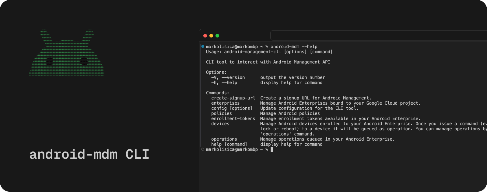

# Android MDM CLI

> Still work in progress...

`android-mdm` is a CLI tool for interacting with Android Enterprise. You can try out features of the [Android Management API (AMAPI)](https://developers.google.com/android/management). With this tool, you can register for Android Enterprise, bind it to your Google Cloud project, enroll devices, enforce policies, and more.

AMAPI is limited until you're an EMM solution (MDM tool) that has been added to the [EMM directory](https://androidenterprisepartners.withgoogle.com/emm/) by Google. To learn more about these limitations, refer to the [permissible usage](https://developers.google.com/android/management/permissible-usage) page.

**TL;DR:** You can enroll up to 500 devices and perform 1000 queries every 100 seconds for each project.

This tool could be useful for experimenting with AMAPI, testing, or possibly managing a small number of devices.

This project was developed during the research phase of Fleet's Android MDM project, where I engaged with the Android Management API (AMAPI) to explore its capabilities. My goal was to simplify the process for others, leading to the creation of this tool to facilitate easier interactions with AMAPI. Fleet itself offers a broader range of features, including UI/API/GitOps interfaces for managing a large number of devices. To learn more, visit [fleetdm.com](https://fleetdm.com).

## How to guide

To manage Android devices with `andorid-mdm` CLI you need to do following.

1. Create Google Cloud project.
2. Enable Android Management API for that project.
3. Create service account that has necessary permissions to manage Android.
4. Create signup URL with `android-mdm create-signup-url`, open URL from response and register new Android Enterprise.
5. Bind registered Android Enterprise to your Google Cloud project.
6. Create enrollment token and default policy
7. Use enrollment token to enroll device.
8. You can add policies and enforce them on your devices (e.g. enforce password requirements, install apps from Play Store, and much more).

See details about each step below.

### Create Google Cloud project 

...

